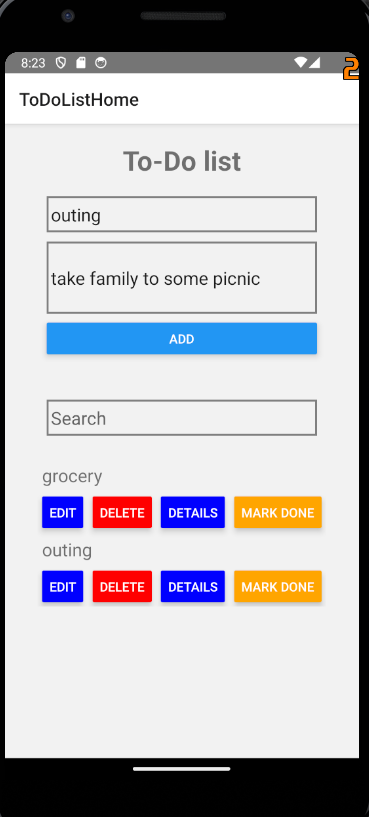
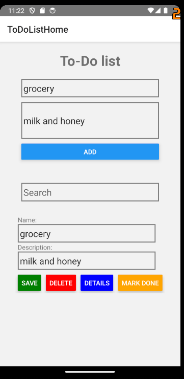
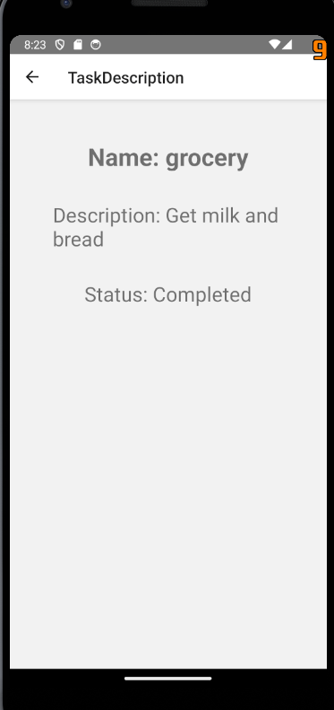
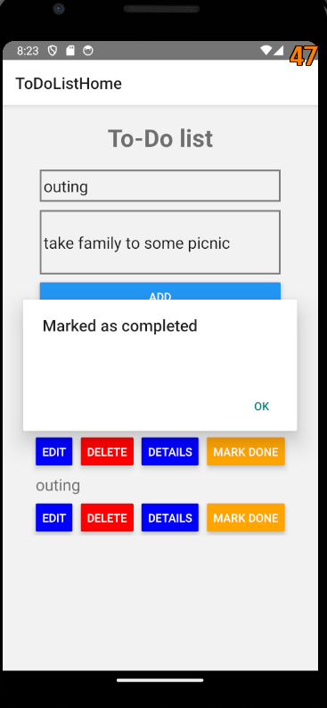

## Main screen
### There are three TextInputs for Name,Description and Search functionality

## Edit
### Shows task's name, and description as default values and offers the user to enter new values.

## Description screen
### Shows task's name, description and if its completed or pending.

## Mark as completed functionality
### The button marks the task as completed if its completed otherwise it shows an alert showing that task has already been marked as completed.

